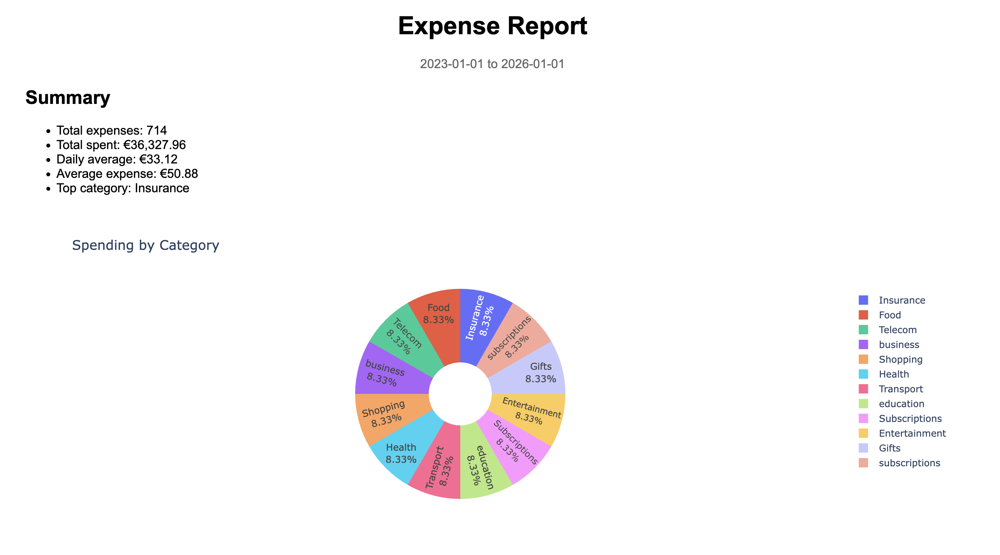
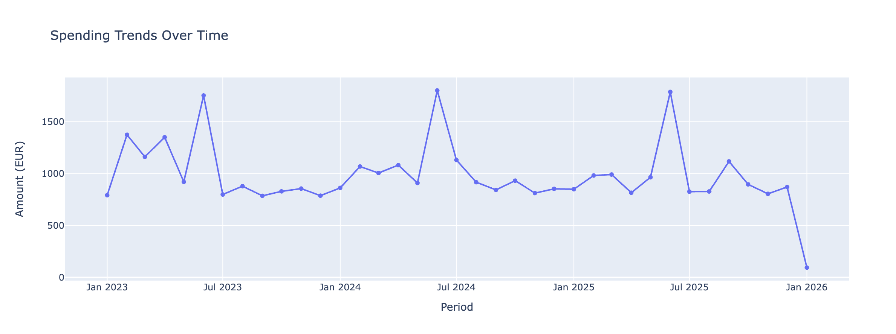
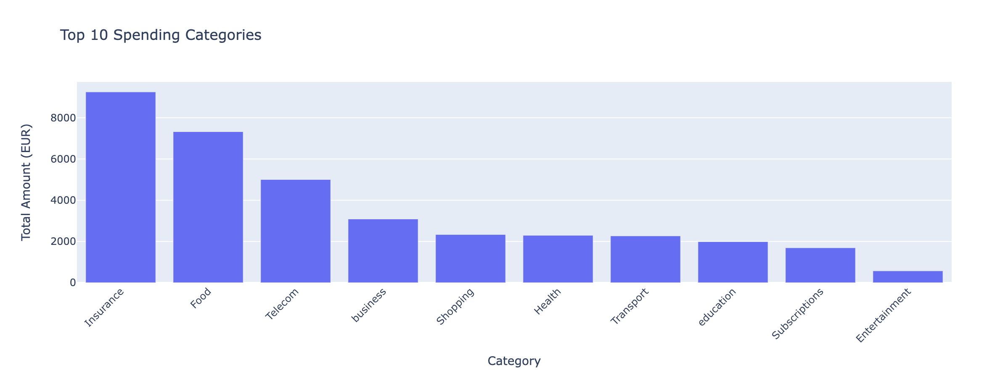
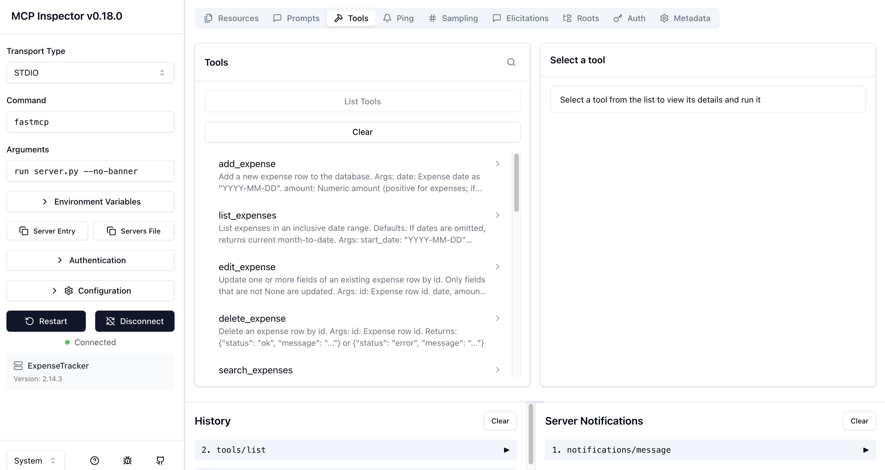
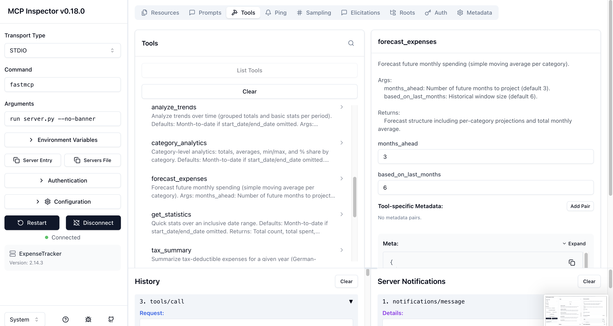

# Expense Tracker MCP Server (FastMCP)

A local **Model Context Protocol (MCP)** server for personal expense tracking built with **FastMCP** + **SQLite**.   It supports CRUD operations, analytics, visual reports, German tax tagging, and reliable import/export workflows.

This repository is designed to be **robust in `fastmcp dev` mode**, where the server is imported as a standalone module (not as a package). To avoid common pitfalls, the implementation:
- uses **absolute imports** (no `from .x import ...`)
- guarantees the **SQLite schema exists on every DB connection**
- for production grade applications you can replace sqlite with PostgreSQL
- treats output paths safely (directory vs file path)
- keeps tool wrappers thin and business logic testable in plain Python modules

---

## Features

### Core expense management
- Add, edit, delete expenses
- List expenses in a date range
- Search & filter: category, note substring, amount bounds, tax deductible, pagination

### Analytics & insights
- Statistics: totals, averages, min/max, top category, most expensive day
- Category analytics: totals + percentages per category
- Trends: day/week/month grouping
- Month-to-month comparison
- Simple moving-average forecast






### Visualizations & reporting
- Interactive **HTML report** (Plotly)
- PNG chart generation (Matplotlib): pie, bar, line, stacked bar
- Export: CSV, JSON, Excel (optional analytics sheets)
- Import: CSV / JSON with tolerant parsing and header normalization


### German tax support
- Tax-deductible flag
- Yearly `tax_summary` grouped into German-friendly buckets (Werbungskosten, Gesundheit, Versicherungen, Spenden, Sonstige)

---

## Directory structure

```
expense_tracker/
  server.py                 # FastMCP entrypoint (tools live here)
  config.py                 # Paths + folders (data/, reports/, outputs/)
  db.py                     # connect() + init_db() (schema guaranteed)
  utils/
    __init__.py
    dates.py                # normalize_date_range utilities
  services/
    __init__.py
    expenses_service.py     # CRUD logic
    analytics_service.py    # summarize/stats/trends/tax/forecast logic
    reports_service.py      # HTML report + chart generation
    io_service.py           # export_data + import_expenses
  data/
    categories.json         # category schema served via expense://categories
    expenses.db             # SQLite database (auto-created)
  reports/                  # default report outputs (auto-created)
  outputs/                  # default export outputs (auto-created)
```

### Key design decisions
- **`server.py`** defines only MCP tool wrappers. All real work is implemented in `services/*`.
- **`db.connect()`** calls `init_db()` automatically so you never hit `no such table: expenses` even if `run()` is not executed.
- **Output path robustness**: `generate_html_report()` and `export_data()` accept either:
  - a full file path OR
  - a directory (a default filename will be created inside it)

---

## Installation

### Prerequisites
- Python **3.12+**
- `uv` package manager

### Install dependencies

```bash
uv add fastmcp matplotlib plotly pandas openpyxl
```

---

## Run the server and Integrate into claude desktop

From the repository root (folder containing `server.py`):

```bash
uv run fastmcp dev server.py
```

If FastMCP cannot infer the server object, specify it explicitly:

```bash
uv run fastmcp dev server.py:mcp
```


```bash
uv run fastmcp install claude-desktop server.py
```

---

## Testing via the local Tools UI

When running in dev mode, you can test tools in the browser:

- Open the tools page shown by FastMCP (often at `http://localhost:6274/#tools`)
- Select a tool, paste JSON arguments, run it

---

## Tool reference

Dates:
- `date`, `start_date`, `end_date`: `YYYY-MM-DD`
- `month1`, `month2`: `YYYY-MM`

### CRUD tools
- `add_expense(date, amount, category, subcategory?, note?, tax_deductible?, currency?, payment_method?)`
- `list_expenses(start_date?, end_date?)`
- `edit_expense(id, ...)`
- `delete_expense(id)`
- `search_expenses(start_date?, end_date?, category?, min_amount?, max_amount?, note_contains?, tax_deductible?, limit?, offset?)`

### Analytics tools
- `summarize(start_date?, end_date?, category?)`
- `category_analytics(start_date?, end_date?)`
- `analyze_trends(start_date?, end_date?, group_by="day|week|month")`
- `get_statistics(start_date?, end_date?)`
- `compare_months(month1, month2, category?)`
- `forecast_expenses(months_ahead=3, based_on_last_months=6)`
- `tax_summary(year, category?)`

### Reports / IO tools
- `generate_html_report(start_date?, end_date?, output_path?)`
- `generate_charts(start_date?, end_date?, chart_types="pie,bar,line", output_dir?)`
- `export_data(start_date?, end_date?, format="csv|json|excel", include_analytics?, output_path?)`
- `import_expenses(file_path, format="csv|json")`

### Resource
- `expense://categories` (returns `data/categories.json`)

---

## Step-by-step test guide (copy/paste JSON)



### 1) Add an expense

```json
{
  "date": "2026-01-10",
  "amount": 12.50,
  "category": "food",
  "subcategory": "groceries",
  "note": "Test expense 1",
  "tax_deductible": 0,
  "currency": "EUR",
  "payment_method": "card"
}
```

Expected: `{"status":"ok","id": ...}`  
Copy the `id`.

### 2) List expenses (January 2026)

```json
{
  "start_date": "2026-01-01",
  "end_date": "2026-01-31"
}
```

### 3) Edit the expense

```json
{
  "id": 1,
  "amount": 15.75,
  "note": "Updated note: lunch + snack",
  "subcategory": "outside_eating"
}
```

### 4) Search by note substring

```json
{
  "note_contains": "snack",
  "min_amount": 5,
  "max_amount": 50,
  "limit": 50,
  "offset": 0
}
```

### 5) Statistics

```json
{
  "start_date": "2026-01-01",
  "end_date": "2026-01-31"
}
```

### 6) Category analytics



```json
{
  "start_date": "2026-01-01",
  "end_date": "2026-01-31"
}
```

### 7) Trends (monthly)

```json
{
  "start_date": "2025-01-01",
  "end_date": "2026-01-31",
  "group_by": "month"
}
```

### 8) Generate an HTML report

**You can pass either a file or a directory.**

**Directory example** (server will create a filename inside):
```json
{
  "start_date": "2025-12-01",
  "end_date": "2025-12-31",
  "output_path": "./reports"
}
```

**File example**:
```json
{
  "start_date": "2025-12-01",
  "end_date": "2025-12-31",
  "output_path": "./reports/expense_report_dec_2025.html"
}
```

### 9) Generate PNG charts

```json
{
  "start_date": "2025-12-01",
  "end_date": "2025-12-31",
  "chart_types": "pie,bar,line,stacked_bar",
  "output_dir": "./reports"
}
```

### 10) Export data (CSV)

Directory path is supported:
```json
{
  "start_date": "2026-01-01",
  "end_date": "2026-01-31",
  "format": "csv",
  "output_path": "./outputs"
}
```

### 11) Import data (CSV)

```json
{
  "file_path": "/absolute/path/to/expenses.csv",
  "format": "csv"
}
```

---

## CSV format expectations (import)

Minimum required columns:
- `date` (YYYY-MM-DD)
- `category`
- `amount`

Optional columns:
- `subcategory`, `note`, `tax_deductible`, `currency`, `payment_method`

The importer is tolerant to common variants:
- amount supports `12.34` and `12,34`
- headers like `booking_date`, `transaction_date`, `description` are recognized

---

## Database schema

Table: `expenses`

| Column | Type | Notes |
|---|---|---|
| id | INTEGER | primary key, autoincrement |
| date | TEXT | `YYYY-MM-DD` |
| amount | REAL | stored as numeric |
| category | TEXT | required |
| subcategory | TEXT | optional |
| note | TEXT | optional |
| tax_deductible | INTEGER | 0/1 |
| currency | TEXT | default EUR |
| payment_method | TEXT | optional |

---

## License

MIT License.
